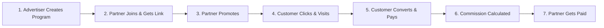
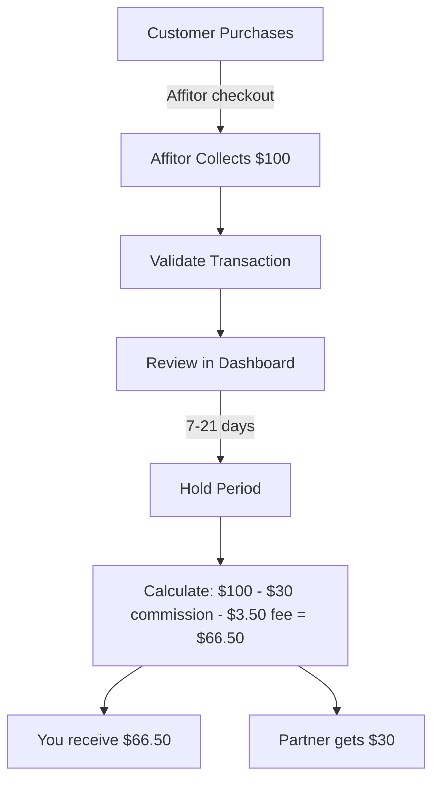
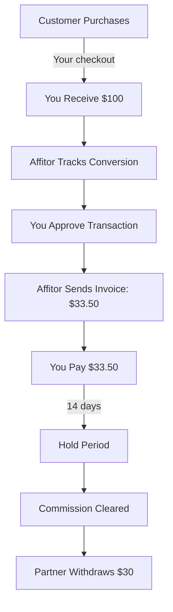
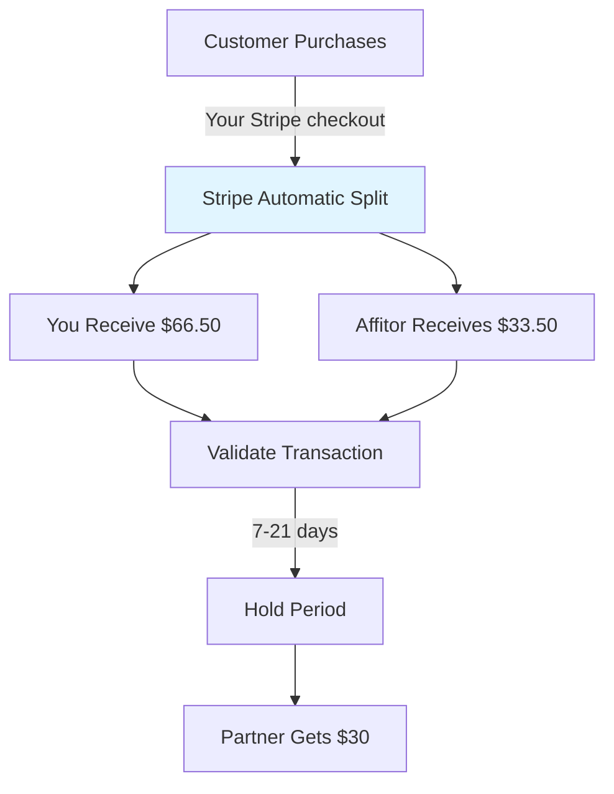
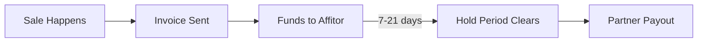
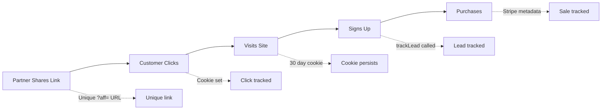
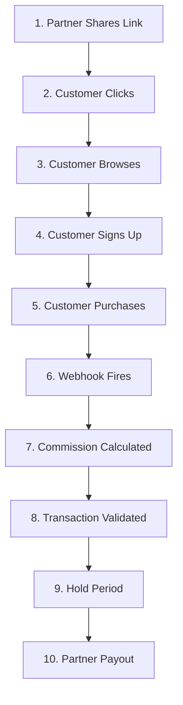

# Diagram Update Summary - Mermaid Version

## Completed - Ultra-Simple Mermaid Diagrams

All diagrams have been converted to **Mermaid flowcharts** - a code-based diagramming syntax that renders directly in markdown. This approach is:

✅ **Simpler** - Plain text, no image files to manage  
✅ **More maintainable** - Edit diagrams by changing code  
✅ **Cleaner** - Minimal, technical documentation style  
✅ **Responsive** - Automatically adapts to screen size  
✅ **Accessible** - Better for screen readers and dark mode  

---

## All Diagrams Converted

### 1. Main User Journey (7-Step Affiliate Lifecycle)
**File**: `/src/content/docs/getting-started/how-it-works.mdx`



✅ **Status**: Simple horizontal flow with numbered steps

---

### 2. Affitor Pay Flow
**File**: `/src/content/docs/advertisers/quickstart/commission-approval-cash-flow.mdx`



✅ **Status**: Vertical flow with fee calculations

---

### 3. Bill Flow
**File**: `/src/content/docs/advertisers/quickstart/commission-approval-cash-flow.mdx`



✅ **Status**: 9-step invoice flow

---

### 4. Split Pay Flow (Coming Soon)
**File**: `/src/content/docs/advertisers/quickstart/commission-approval-cash-flow.mdx`



✅ **Status**: Fork diagram showing parallel fund splitting

---

### 5. Payout Lifecycle
**File**: `/src/content/docs/advertisers/quickstart/payouts.mdx`



✅ **Status**: Simple horizontal 5-step flow

---

### 6. Tracking Lifecycle
**File**: `/src/content/docs/advertisers/tracking/tracking-overview.mdx`



✅ **Status**: Dual-track flow with technical annotations (dotted lines)

---

### 7. Complete Payment Flow
**File**: `/src/content/docs/advertisers/tracking/payment-flow.mdx`



✅ **Status**: 10-step numbered vertical flow

---

## Mermaid Syntax Benefits

### Easy to Edit
Just edit the text to change the diagram:
```mermaid
A[Step 1] --> B[Step 2]
```

### Supports Different Styles
- `-->` = Solid arrow
- `-.->` = Dotted arrow (for annotations)
- `-->|label|` = Arrow with label
- `style X fill:#color` = Color individual nodes

### Automatic Rendering
Mermaid diagrams render automatically in:
- GitHub
- GitLab
- Astro/Starlight documentation
- Markdown preview tools
- Most modern documentation platforms

---

## Files Modified

1. ✅ `/src/content/docs/getting-started/how-it-works.mdx`
2. ✅ `/src/content/docs/advertisers/quickstart/commission-approval-cash-flow.mdx` (3 diagrams)
3. ✅ `/src/content/docs/advertisers/quickstart/payouts.mdx`
4. ✅ `/src/content/docs/advertisers/tracking/tracking-overview.mdx`
5. ✅ `/src/content/docs/advertisers/tracking/payment-flow.mdx`

---

## Next Steps (Optional)

### If Mermaid doesn't render in your setup:
1. Check if Starlight has Mermaid support enabled
2. Install Mermaid plugin if needed: `npm install remark-mermaidjs`
3. Or keep the PNG images in `/public/images/` as fallback

### To customize diagram styling:
1. Edit the Mermaid code directly in the `.mdx` files
2. Add colors: `style NodeName fill:#hexcolor`
3. Change arrow types: `--->` (thick), `==>` (thick with arrow), etc.

---

**Date**: 2026-01-23  
**Status**: Complete - All diagrams converted to Mermaid ✅  
**Advantage**: Code-based, maintainable, simpler, no image quota issues
