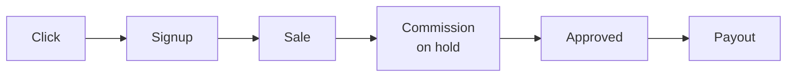

Starting an affiliate program for your SaaS comes down to six decisions: what you pay, which software runs it, how sales get attributed, who you recruit, when money moves, and what you watch in the first ninety days. This guide takes them in order as six steps, with 2026 benchmark numbers where verified data exists, and links to honest comparisons where the right answer depends on your stage.

One principle sits under all six. An affiliate program is performance spend: you pay after revenue arrives, not before. That is what makes it attractive next to ads. Every decision below either protects that property or quietly gives it away, so when two options look equal, pick the one that keeps your costs proportional to results.

## Quick answer: how do you start a SaaS affiliate program?

Start a SaaS affiliate program in six steps: set a commission in the 20–25% band that stays within 30–40% of your gross margin, pick software priced for your stage (floors run $0 to $1,000+/month as of July 2026), install tracking that survives cookie loss, hand-recruit your first five to twenty aligned partners, set payout holds that match your refund window, and spend the first ninety days measuring click-to-signup rate per partner rather than revenue. The cheapest way to run the software decision: Affitor charges $0/month until your affiliates generate their first $10,000, so the program costs nothing until it works.

| Tool | Best for | From price (as of Jul 2026) | Transaction fee | Attribution |
|---|---|---|---|---|
| [Affitor](https://affitor.com) | Starting from zero, paying on results | $0/mo | 3.5% on affiliate-driven sales after first $10K | Signup-anchored via Stripe metadata |
| [Rewardful](https://www.rewardful.com/pricing) | The known flat-fee default for Stripe | $49/mo | 0% | Cookie, 60-day default |
| [FirstPromoter](https://firstpromoter.com/pricing) | Billing beyond Stripe and Paddle | $49/mo | None stated | Cookie, 60-day default |
| [Tolt](https://tolt.com/pricing) | Unlimited affiliates on a flat fee | $69/mo | 2% on automated payouts | Cookie, configurable window |
| [Dub Partners](https://dub.co/pricing) | Developer-first teams | $90/mo | 5% payout fee (3% Enterprise) | Signup/lead-anchored |
| [PartnerStack](https://www.partnerstack.com/pricing) | Enterprise multi-type programs | From $1,000/mo (paid annually) | None published | Not publicly documented |

Every price on this page was checked against each vendor's live pricing page on July 5, 2026.

## Step 1: Decide what you'll pay


Start from the benchmark, then adjust for your margin. The typical SaaS affiliate commission is 20% of the revenue a partner generates. An analysis of 96 real percentage-based campaigns puts the average at 23.3%, with 20-25% the most common band. Mature programs tend to settle at 15-25%, inside an overall industry range of 5-30%.

The commission model matters as much as the rate:

| Commission model | How it pays | Best for |
|---|---|---|
| Recurring percentage | A share of every referred payment, typically for 12+ months | Subscription SaaS — in renewal-paying programs, 70% of commission events are renewals |
| One-time bounty | A fixed amount per converted customer | Simple budgeting, high-touch sales-assisted deals |
| Hybrid | A recurring share plus a signup bonus | Competing for established affiliates who compare programs on both |

Two rules keep the number safe:

**Stay within 30-40% of your gross margin.** Commission is a cut of margin, not of revenue. If your gross margin is 80%, a 20% commission consumes a quarter of it, comfortably inside the guidance. At 60% margin, the same 20% commission eats a third of it, which is already inside the 30-40% ceiling. Run this arithmetic before you publish a rate, because raising is easy and cutting is a partner-relations problem.

**Prefer recurring commissions over one-time bounties.** In programs that pay on renewals, 70% of all commission events are renewal payments. Most of what a good partner earns arrives after the first sale, and that ongoing stake is exactly what keeps them promoting you next quarter instead of the next tool. If your margin allows it, pay on renewals for at least the first year of each referred subscription.

For the full treatment, including a worked example and how to run different rates for different partner tiers, see [What commission rate should your SaaS affiliate program pay?](/blog/saas-affiliate-commission-rates)

## Step 2: Choose your software

Four criteria separate the tools. Weigh them before you look at a single feature list.

**Pricing model.** Every major tool except one charges a monthly subscription before your program has produced anything. As of July 2026 the floors are: Rewardful $49/mo, FirstPromoter $49/mo, Tolt $69/mo, Dub Partners $90/mo, and PartnerStack from $1,000/mo paid annually. Some also charge twice: Dub adds a 5% payout fee on its Business and Advanced plans, Tolt takes a 2% processing fee on automated payouts, and impact.com layers a 2.5% transaction fee on top of its subscription. Watch revenue caps too. Entry tiers commonly cap the monthly affiliate revenue you can process (FirstPromoter at $5,000/mo, Rewardful at $7,500/mo), which means a program that works forces an upgrade. Prices drift fast, so re-check each vendor's live pricing page before you commit.

**Attribution durability.** Ask where attribution actually lives: in a browser cookie that expires, or anchored to something durable like the customer's signup identity. Step 3 explains why this decides whether partners trust your numbers.

**Billing fit.** Stripe has no native affiliate feature, so whatever you pick must plug into your billing stack. On Stripe you have the widest menu. Off Stripe, the shortlist narrows quickly: Rewardful covers Stripe and Paddle, Tolt covers Stripe, Paddle, and Chargebee, and FirstPromoter integrates with five billing providers (Stripe, Paddle, Recurly, Chargebee, Braintree).

**Agent surface.** In 2026 there is a real chance the "developer" wiring your integration is an AI coding agent. As of a June 2026 audit, none of the seven major competitors ships an official MCP server or an agent-completable integration runbook with a self-verification loop. APIs exist (Rewardful includes its REST API on every tier; FirstPromoter gates it behind its $99 plan), but they are built for human developers reading docs.

Where Affitor fits, with the obvious disclosure that I build it: Affitor is the performance-priced option. You pay $0 until your program earns its first $10,000 through affiliates, then 3.5% on affiliate-driven sales only. No monthly fee, no setup fee; the 3.5% is the whole cost. It is also the tool built agent-first: an AI coding agent can complete the entire integration from one paste line and prove it worked, which no other tool in the set offered as of that June 2026 audit. And the honest counterpoints: if you want the most recognized brand and a simple flat subscription for a Stripe SaaS, Rewardful is the category default and its 0% transaction fee is genuine. If you run affiliates, resellers, and referral partners at enterprise scale, PartnerStack is a full partner-management suite that Affitor does not try to be.

The detailed trade-offs live in dedicated comparisons: [the best affiliate software for SaaS by stage](/blog/best-affiliate-software-for-saas), [Rewardful alternatives](/blog/rewardful-alternatives), [PartnerStack alternatives](/blog/partnerstack-alternatives), [FirstPromoter alternatives](/blog/firstpromoter-alternatives), [Rewardful vs FirstPromoter](/blog/rewardful-vs-firstpromoter), and [Rewardful vs Tolt](/blog/rewardful-vs-tolt).

## Step 3: Set up tracking that survives real customers

The whole program rests on one chain: click, signup, sale. A partner sends a visitor, the visitor becomes a signup, the signup becomes a paying customer, and every later invoice traces back to the partner who started it.



*Every affiliate program runs this loop: a partner's click becomes a signup, the signup becomes attributed sales, and each sale creates a commission that clears a hold period before it is paid out.*

Where tools differ is what carries attribution across that chain. Rewardful, FirstPromoter, and Tolt attribute through cookie windows (Rewardful and FirstPromoter default to 60 days; Tolt's window is configurable). Cookies work when the buyer stays in one browser and converts inside the window. They fail when the cookie is cleared, blocked, or the buyer switches from their phone to their work laptop before paying, and the partner silently loses credit. To be fair to the category, Dub Partners anchors attribution to the signup rather than the cookie, the same architectural bet Affitor makes.

Affitor's chain works like this: a lightweight browser snippet stores the click in an `affitor_click_id` cookie, your signup handler sends a server-side lead event that binds the click to the customer's identity, and sale events ride Stripe metadata on the Checkout Session. Once the signup is recorded, attribution no longer depends on the cookie at all: the chain runs click to signup identity to Stripe customer, and it survives cookie loss and device switches.

You can also prove the whole thing works before a single real customer arrives:

```bash title="terminal"
npx affitor onboard
```

The CLI detects your stack, installs click tracking, injects the sale call into your Stripe webhook handler, and then fires a synthetic click, lead, and sale through the live pipeline. When the readiness check returns `integration_verified: true`, tracking is proven end to end. The same capability is exposed to AI agents through an MCP server with 7 tools and a public `skill.md` runbook, so "set up tracking" can be a ten-minute delegation to your coding agent instead of a sprint task.

Setup details live in the docs: [how the tracking pieces fit together](/brand/tracking/tracking-overview), [payment tracking with Stripe](/brand/tracking/payment-tracking-stripe), and [testing your integration end to end](/brand/tracking/testing-integration). If you are on Stripe, the companion guide [How to create a Stripe affiliate program](/blog/stripe-affiliate-program) walks the whole integration step by step.

## Step 4: Recruit your first partners


Software launches nothing. Your first ten partners will be hand-recruited, and that is normal. Five to twenty aligned partners beat a hundred random affiliates, so work the channels in order of warmth:

1. **Your own customers.** They already use the product, believe its pitch, and often have exactly the audience you want. An email to your most engaged accounts announcing the program is the highest-conversion outreach you will ever send.
2. **Creators already covering your category.** Find the people writing comparisons, filming tutorials, and ranking for the searches your buyers make. Personalize the pitch: name the piece of theirs you read and state your commission terms plainly.
3. **Communities where your buyers gather.** Founders' Slacks, subreddits, Discords, newsletters. Contribute first; recruit second.
4. **Partners of adjacent products.** People who already promote tools your customers use know how to sell software like yours. They are the fastest to activate because the workflow is not new to them.
5. **A marketplace listing.** List your program where affiliates already browse. In Affitor, opt your program into the [marketplace](https://affitor.com/marketplace), and partners discover and apply on their own; you approve manually or set auto-accept. See [reviewing partner applications](/brand/quickstart/partner-approval-quality-control).
6. **Direct invites.** For the names you already have, skip the application queue entirely. Affitor's [partner invites](/brand/quickstart/inviting-partners) take typed emails or a CSV, auto-write the invitation email from your program's real terms, and activate the partner the moment they accept. Unaccepted invites expire automatically.

Recruit for fit, not follower count. One partner whose audience actually buys SaaS beats ten whose audiences scroll past, and you will see the difference in your click-to-signup numbers within weeks.

## Step 5: Set payout terms that match your refund policy

Money mechanics decide whether the program feels safe to run. Three settings do most of the work:

**Hold periods.** Never pay commission on revenue that can still be refunded. Set the hold at least as long as your refund window, plus a buffer for disputes. In Affitor, every commission is created on hold and approves after the hold expires, either manually or automatically if you enable auto-approve.

:::tip

Match the hold period to your refund window before launch. It is the one payout setting that is awkward to tighten later, because shortening feels fine to partners and lengthening feels like a rug-pull.

:::

**Refund clawbacks.** When a payment is refunded or disputed, the commission should reverse automatically. Affitor does this out of the box, with every state change kept in an audit trail. Whatever tool you choose, confirm this behavior before you buy, because manual clawbacks are the kind of chore that stops happening after month two.

**Payout thresholds.** A minimum balance before withdrawal keeps you from processing five-dollar payouts. Once a partner crosses your threshold, Affitor pays out by bank transfer, PayPal, Stripe, or Wise.

The mechanics are documented in [commission approval and cash flow](/brand/quickstart/commission-approval-cash-flow) and [payouts](/brand/quickstart/payouts); rate and hold configuration lives in [define commission](/brand/quickstart/define-commission).

## Step 6: Launch and measure the first ninety days

Expect the start to be quiet, and plan around it. A partner recruited today publishes content in a few weeks, that content converts a visitor weeks later, and the resulting commission clears its hold after that. The loop in the diagram above is measured in months the first time through. What matters early is not revenue; it is proof that each stage of the loop works.

**Month 1: prove the plumbing and land the first partners.** Verify tracking end to end before announcing anything (a synthetic test chain, or a real test purchase). Get your listing live, send your first invites, and confirm every accepted partner has their link. The number to watch: how many recruited partners generated at least one click.

**Month 2: watch the first commissions move.** Real clicks should be turning into signups, and the first sales into on-hold commissions. Check attribution quality (sales landing on the right partner), confirm refunds reverse commissions, and make sure the hold and approval flow behaves the way you configured it. The number to watch: click-to-signup rate per partner, which tells you whose audience actually matches your product.

**Month 3: judge channels, not partners.** Look at which recruiting channel produced the partners who drive revenue, then double down there and stop spending time on the rest. If the data says your rate is wrong, adjust it going forward rather than retroactively; in Affitor, commission policies are versioned and apply from an effective date, so a rate change never rewrites history. Program-level metrics live in [performance tracking](/brand/quickstart/view-performance).

## Key takeaways

- A 20–25% recurring commission is the SaaS standard; keep it within 30–40% of your gross margin.
- In renewal-paying programs, 70% of commission events are renewals — recurring beats one-time for subscription businesses.
- A 60-day cookie window is the category default, and signup-anchored attribution is what survives when the cookie dies.
- Software floors run $49–$1,000+/month as of July 2026; Affitor is the $0/month exception, charging 3.5% only after your first $10,000 in affiliate revenue.
- Five to twenty aligned partners beat a hundred random affiliates.
- Set the commission hold at least as long as your refund window, and make clawbacks automatic.
- Measure the first ninety days by stage — clicks, then click-to-signup rate, then revenue by channel — not by revenue totals.

## FAQ

### How much should a SaaS affiliate program pay?

The typical SaaS affiliate commission is 20% of the revenue a partner generates, with 20–25% the most common band; an analysis of 96 real percentage-based campaigns puts the average at 23.3%, inside an overall industry range of 5–30%. Keep the rate within 30–40% of your gross margin and prefer recurring commissions on renewals over one-time bounties.

### How much does affiliate program software cost in 2026?

Monthly floors as of July 5, 2026: Rewardful $49, FirstPromoter $49, Tolt $69, Dub Partners $90 (plus a 5% payout fee), and PartnerStack from $1,000 paid annually. Affitor is the exception at $0/month, charging 3.5% on affiliate-driven sales only after your first $10,000 in affiliate revenue.

### How long should the affiliate cookie window be?

60 days is the category default — Rewardful and FirstPromoter both ship 60-day cookie windows out of the box. The deeper question is what happens when the cookie dies: signup-anchored attribution (Affitor, and architecturally Dub) survives cleared cookies and device switches, while pure cookie models silently drop the referral.

### How many affiliates do you need to start a SaaS affiliate program?

Five to twenty aligned partners beat a hundred random affiliates. Your first ten will be hand-recruited — from your own customers, creators already covering your category, and communities where your buyers gather — and one partner whose audience actually buys SaaS outperforms ten whose audiences scroll past.

### How long until an affiliate program produces revenue?

Plan in months, not weeks. A partner recruited today publishes content in a few weeks, that content converts visitors weeks later, and the resulting commission clears its hold period after that. In the first ninety days, measure proof that each stage works — clicks per partner in month one, click-to-signup rate in month two, revenue by recruiting channel in month three — not revenue totals.

### Should commissions be recurring or one-time?

Recurring, if your margin allows it. In programs that pay on renewals, 70% of all commission events are renewal payments — most of what a good partner earns arrives after the first sale, and that ongoing stake is exactly what keeps them promoting you next quarter.

## What's next

You have the six steps: a rate grounded in the 20-25% benchmark and your margin, software priced the way you want to pay, tracking that survives real customers, a recruiting plan that starts warm, payout terms that match your refund policy, and a ninety-day measurement plan. Two ways to move:

- **Start the program.** [Create your Affitor program](https://affitor.com/welcome). It costs $0 until your program earns its first $10,000 through affiliates, so the software decision does not need a budget meeting.
- **Go deeper on the mechanics.** The [advertiser quickstart](/brand/quickstart) walks from account creation to a configured program, and the [tracking overview](/brand/tracking/tracking-overview) explains the attribution chain in full.
