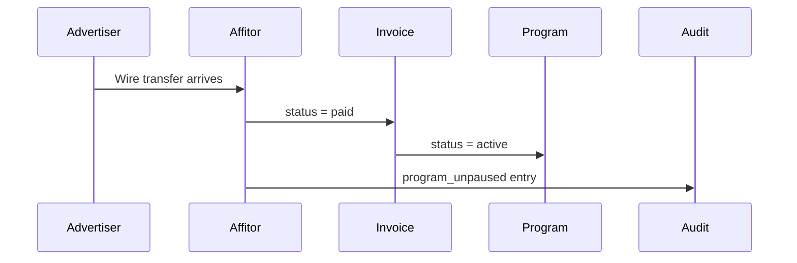

When a commission invoice is not paid by its due date, Affitor pauses the program until the balance clears. Tracking links keep working, partner data is preserved, and the program returns to active automatically as soon as the payment lands.

<PageMeta
  items={[
    { label: 'Who this is for', value: 'Advertisers, finance, and ops teams' },
    { label: 'Time required', value: '4 minutes' },
    { label: 'Outcome', value: 'You know the invoice timeline, what triggers a pause, and how to resume' },
  ]}
/>

## The billing timeline

<Flow>
  <FlowStep>Sales attributed Mon–Sun</FlowStep>
  <FlowStep>Invoice issued Mon 09:00 UTC</FlowStep>
  <FlowStep>Pay within 7 days → **paid:** Status: paid · **past due:** Status: overdue</FlowStep>
  <FlowStep>Program paused</FlowStep>
  <FlowStep>Mark invoice paid</FlowStep>
  <FlowStep>Program auto-resumed</FlowStep>
</Flow>

| Stage | When | What happens |
|-------|------|--------------|
| **Invoice issued** | Every Monday at 09:00 UTC | Invoice covers the prior Monday–Sunday commission period |
| **Net terms** | 7 days from issue date | The default. Talk to your account contact if you need different terms |
| **Overdue check** | Daily at 10:00 UTC | Invoices past their due date are marked overdue |
| **Program paused** | Same overdue run | The program enters a paused state; an email is sent to the workspace owner |
| **Auto-resume** | The moment the invoice is marked paid | The program returns to active immediately, without any manual action |

---

## When a program is paused

Pause is triggered automatically the first time a commission invoice passes its due date.

### What changes while paused

- **Program status** flips to **Paused** in your dashboard and in partner-facing views.
- **Marketplace visibility** — paused programs are hidden from public partner discovery. Existing partners keep their dashboard access.
- **Audit log** records the transition with a reference to the originating invoice.

### What does not change while paused

- **Existing tracking links** continue to resolve. Affitor never breaks partner URLs while you resolve billing.
- **Click and lead events** continue to be recorded for attribution accounting. Whether those events accrue commission for the paused period is determined by your commission rules at the time the sale settles.
- **Partner data** — referrals, audience, and historic commissions are preserved in full.
- **Stripe Connect and customer-facing checkout** continue to work. Pause is a billing state, not a checkout state.

> Pause is a billing signal, not a tracking kill switch. Your customers are unaffected. Partners see the program as paused inside their dashboard and stop receiving new applications.

---

## How to resume

A paused program returns to active automatically the moment the overdue invoice is marked paid. No manual reactivation is required.

<FlowGrid>
  <FlowCard step="1" title="Send the wire transfer">
    Wire to the Wise account shown on the invoice page. Always include the invoice number in the transfer reference so we can match the payment.
  </FlowCard>
  <FlowCard step="2" title="Affitor reconciles the payment">
    The invoice is marked paid, typically within 24 hours of the funds landing.
  </FlowCard>
  <FlowCard step="3" title="Your program returns to active">
    The audit log records the unpause with the invoice number. No manual action required.
  </FlowCard>
</FlowGrid>

If you've already paid but the program is still paused after 24 hours, contact billing — the most common cause is a missing invoice number on the transfer reference.

---

## How to pay an invoice

Affitor currently bills through Wise wire transfers. Each invoice page shows the destination account, beneficiary, and the exact amount due.

| Field | Where to find it |
|-------|------------------|
| Destination account | Invoice page in the advertiser dashboard |
| Reference | Invoice number, e.g. `INV-2026-06-0042` |
| Amount | Total commission for the period |
| Due date | 7 days after invoice issued |

> Stripe Checkout is also available as a payment option for overdue invoices. Use it from the invoice page as an alternative to wire transfer.

---

## Avoiding pause

<TaskCardGrid>
  <TaskCard title="Pay within the 7-day window" href="#how-to-pay-an-invoice">
    Treat the invoice email as the trigger. Don't wait for the overdue email.
  </TaskCard>
  <TaskCard title="Allowlist billing@affitor.com" href="mailto:billing@affitor.com">
    Add the address to your AP allowlist so invoice and overdue emails reach the right inbox.
  </TaskCard>
  <TaskCard title="Pre-fund or extend net terms" href="mailto:billing@affitor.com">
    If your AP cycle is longer than 7 days, talk to your account contact to align timing or extend net terms.
  </TaskCard>
</TaskCardGrid>

---

## Questions?

- **Billing**: [billing@affitor.com](mailto:billing@affitor.com)
- **General support**: [support@affitor.com](mailto:support@affitor.com)

<NextStep
  title="Set up your affiliate program"
  description="Have the program configured before the first commission invoice runs so timing and net terms match your AP cycle."
  href="/advertisers/quickstart/setup-program"
  ctaLabel="Open setup guide"
/>
