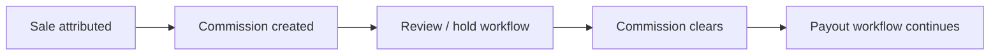

# Payouts

Affitor handles the partner payout workflow after commissions are attributed, reviewed, and cleared.

---

## How Payouts Work

At a high level:
1. a sale is attributed
2. commission is created
3. commission moves through review / hold workflow
4. cleared earnings become withdrawable within the payout process
5. partner payout is processed through Affitor

You do not need to manage individual partner transfers yourself.

---

## Payout Methods

Depending on availability and partner setup, payout methods can include:

| Method | Notes |
|--------|-------|
| Bank transfer | Common partner payout path |
| Wise | Used where supported |
| Stripe | Used where supported |

Partners manage their payout details inside the payout workflow; advertisers do not need to collect bank details directly.

---

## Balance States

| State | Meaning |
|-------|---------|
| **Pending** | Still in hold/review workflow |
| **Withdrawable** | Cleared and available for payout workflow |
| **Paid** | Completed payout |

---

## Your Role as Advertiser

| Do | Don’t |
|----|-------|
| review transactions/commissions where needed | manage individual partner bank transfers |
| configure commission and hold settings | build your own payout ops layer for each partner |
| monitor affiliate cost and performance | manually reconcile every partner payment outside the workflow |

---

## Refunds

If a refund happens, the commission is reconciled through the commission/payout workflow based on where it currently sits in the lifecycle.

---

## Related Guides

- **[Commission Approval & Cash Flow](/docs/advertisers/quickstart/commission-approval-cash-flow)**
- **[View Performance](/docs/advertisers/quickstart/view-performance)**
- **[Pricing](/docs/getting-started/pricing-performance-model)**
