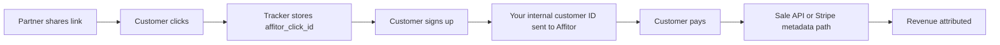

Affitor tracking connects three events into one attribution chain:

- **click** — a visitor arrives through an affiliate link
- **signup/lead** — you identify the customer after registration
- **sale** — revenue is recorded through the Sale API or Stripe Bill Flow

---

## The Core Model

Every successful integration has the same shape:

1. a tracked affiliate visit creates a click/customer relationship
2. signup tracking attaches your internal user ID to that relationship
3. sale tracking records revenue against the same customer/partner relationship

That is why identifier consistency matters more than any single code snippet.

---

## The Tracking Flow



---

## What You Need to Implement

### 1. Click tracking

Install the tracker so affiliate visits are detected automatically.

- detects `?aff=`
- stores `affitor_click_id`
- creates the initial relationship Affitor needs for attribution

Guide: [Pageview Tracker](/docs/advertisers/tracking/pageview-tracker-click/)

### 2. Signup tracking

Send your internal customer/user identifier after signup succeeds.

- browser helper: `signup(customerKey, email)`
- server API: `POST /api/v1/track/lead` with `customer_key`

Guide: [Lead Tracking](/docs/advertisers/tracking/lead-tracking-signup/)

### 3. Sale tracking

Choose one supported revenue path:

| Path | Use when |
|------|----------|
| **Sale API** | your backend controls revenue events |
| **Stripe metadata + webhook** | you already use Stripe Checkout / Bill Flow |

Guide: [Payment Tracking](/docs/advertisers/tracking/payment-tracking-stripe/)

---

## Recommended Identifier Mapping

| Context | Field |
|--------|-------|
| Signup helper | `customerKey` |
| Lead API | `customer_key` |
| Sale API | `customer_key` |
| Stripe metadata | `affitor_customer_key` |
| Browser click cookie | `affitor_click_id` |
| Sale API click field | `click_id` |

Use one stable internal customer ID everywhere.

---

## Attribution Basics

### Default model

Affitor public docs currently describe:
- first-party cookie tracking
- last-click attribution
- a 60-day default attribution window

### Why the signup step matters

The click cookie is strong, but the internal customer ID is what lets Affitor keep attribution working more reliably across later payment events, especially when payment happens after signup or on a backend-controlled path.

---

## One-Time vs Subscription Payments

### One-time payment

Either:
- send a Sale API event after payment succeeds
- or attach Stripe metadata for Bill Flow

### Subscription payment

If you use Stripe subscriptions:
- include metadata on the checkout session
- include the same metadata on `subscription_data.metadata`

Without the subscription metadata, renewals may not be attributable.

---

## What Most Teams Choose

### Fastest path — Affitor CLI

```bash
npx affitor init          # creates program + outputs tracking snippets
npx affitor setup stripe  # auto-configures Stripe webhooks via OAuth
npx affitor test sale     # verifies the full pipeline
```

The CLI handles program creation, Stripe webhook configuration, and test events in three commands. See the [CLI Quickstart](/docs/advertisers/cli/quickstart/).

### Fastest path for Stripe Checkout teams (manual)

1. install tracker
2. call `signup(customerKey, email)`
3. attach Stripe metadata for payment + subscription flows

### Fastest path for custom backend teams (manual)

1. install tracker
2. call `signup(customerKey, email)` or server-side lead API
3. send `POST /api/v1/track/sale` from your backend

---

## Related Guides

1. [Pageview Tracker](/docs/advertisers/tracking/pageview-tracker-click/)
2. [Lead Tracking](/docs/advertisers/tracking/lead-tracking-signup/)
3. [Payment Tracking](/docs/advertisers/tracking/payment-tracking-stripe/)
4. [Testing Integration](/docs/advertisers/tracking/testing-integration/)
