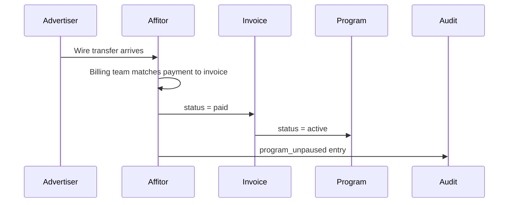

When a commission invoice is not paid by its due date, Affitor pauses the program until the balance clears. Tracking links keep working, partner data is preserved, and the program returns to active automatically once the overdue invoice is marked paid.

<PageMeta
  items={[
    { label: 'Who this is for', value: 'Advertisers, finance, and ops teams' },
    { label: 'Time required', value: '4 minutes' },
    { label: 'Outcome', value: 'You know the invoice timeline, what triggers a pause, and how to resume' },
  ]}
/>

## The billing timeline

<Flow>
  <FlowStep>Commissions approved</FlowStep>
  <FlowStep>Invoice issued Mon 09:00 UTC</FlowStep>
  <FlowStep>Pay within 7 days → **paid:** Status: paid · **past due:** Status: overdue</FlowStep>
  <FlowStep>Program paused</FlowStep>
  <FlowStep>Mark invoice paid</FlowStep>
  <FlowStep>Program auto-resumed</FlowStep>
</Flow>

| Stage | When | What happens |
|-------|------|--------------|
| **Invoice issued** | Every Monday at 09:00 UTC | Invoice includes every approved commission not yet on an invoice, whenever it was approved. Its billing period (the prior Monday–Sunday) is a label and does not limit what it includes |
| **Invoice minimum** | Each Monday | If the approved commissions add up to less than the invoice minimum (currently $10), no invoice is issued that week. They carry forward and appear on a later invoice |
| **Net terms** | 7 days from issue date | The default. Talk to your account contact if you need different terms |
| **Overdue check** | Daily at 10:00 UTC | Invoices past their due date are marked overdue |
| **Program paused** | Same overdue run | The program enters a paused state; an email is sent to the workspace owner |
| **Auto-resume** | When the invoice is marked paid | The program returns to active on its own; you do not need to reactivate it. A wire transfer is marked paid by Affitor's billing team after they match it to the invoice |

---

## When a program is paused

Pause is triggered automatically the first time a commission invoice passes its due date.

### What changes while paused

- **Program status** flips to **Paused** in your dashboard and in partner-facing views.
- **Marketplace visibility** — paused programs are hidden from public partner discovery. Existing partners keep their dashboard access.
- **Audit log** records the transition with a reference to the originating invoice.

### What does not change while paused

- **Existing tracking links** continue to resolve. Affitor never breaks partner URLs while you resolve billing.
- **Click, lead, and sale events** continue to be recorded. Sales attributed while paused still create commissions and platform fees exactly as when the program is active, and they appear on your next invoice. Pausing does not stop charges from accruing.
- **Partner data** — referrals, audience, and historic commissions are preserved in full.
- **Stripe Connect and customer-facing checkout** continue to work. Pause is a billing state, not a checkout state.

> Pause is a billing signal, not a tracking kill switch. Your customers are unaffected. Partners see the program as paused inside their dashboard and stop receiving new applications.

---

## How to resume

A paused program returns to active automatically when the overdue invoice is marked paid. You do not need to reactivate it yourself. For a wire transfer, the invoice is marked paid once Affitor's billing team has matched your payment to it.

<FlowGrid>
  <FlowCard step="1" title="Send the wire transfer">
    Wire to the Wise account shown on the invoice page. Always include the invoice number in the transfer reference so we can match the payment.
  </FlowCard>
  <FlowCard step="2" title="Affitor reconciles the payment">
    Affitor's billing team matches the transfer to your invoice and marks it paid.
  </FlowCard>
  <FlowCard step="3" title="Your program returns to active">
    Marking the invoice paid resumes the program, and the audit log records the unpause with the invoice number. You don't need to reactivate anything.
  </FlowCard>
</FlowGrid>

If you've paid and the program is still paused a business day later, contact billing — the most common cause is a missing invoice number in the transfer reference.

---

## How to pay an invoice

Affitor bills through Wise wire transfers. Each invoice page shows the destination account, beneficiary, and the exact amount due. You pay the invoice to Affitor LLC, the beneficiary shown on the invoice; Affitor then pays partners their withdrawals.

| Field | Where to find it |
|-------|------------------|
| Destination account | Invoice page in the advertiser dashboard |
| Reference | Invoice number, e.g. `INV-2026-06-0042` |
| Amount | Total due: the approved commissions on the invoice plus the platform fee |
| Due date | 7 days after invoice issued |

> Card payment through Stripe Checkout is off by default and is not available on every account. If your invoice page shows a pay-by-card option, you can use it for pending or overdue invoices as an alternative to wire transfer, and the invoice is marked paid when the checkout completes. Otherwise, pay by wire.

---

## Avoiding pause

<TaskCardGrid>
  <TaskCard title="Pay within the 7-day window" href="#how-to-pay-an-invoice">
    Check the Billing tab after each Monday's invoice run. A new-invoice email is not sent on every account, so don't wait for an email — and don't wait for the overdue email.
  </TaskCard>
  <TaskCard title="Allowlist noreply@affitor.com and billing@affitor.com" href="mailto:billing@affitor.com">
    Billing emails are sent from noreply@affitor.com with billing@affitor.com as the reply-to address. Add both to your AP allowlist so invoice and overdue emails reach the right inbox.
  </TaskCard>
  <TaskCard title="Pre-fund or extend net terms" href="mailto:billing@affitor.com">
    If your AP cycle is longer than 7 days, talk to your account contact to align timing or extend net terms.
  </TaskCard>
</TaskCardGrid>

---

## Questions?

- **Billing**: [billing@affitor.com](mailto:billing@affitor.com)
- **General support**: [support@affitor.com](mailto:support@affitor.com)

<NextStep
  title="Set up your affiliate program"
  description="Have the program configured before the first commission invoice runs so timing and net terms match your AP cycle."
  href="/brand/quickstart/setup-program"
  ctaLabel="Open setup guide"
/>
