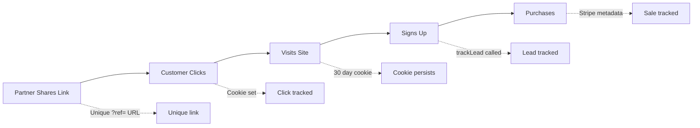

Affitor tracking captures the complete customer journey—from the first click on an affiliate link to the final purchase.

---

## How Tracking Works

When a partner shares their affiliate link, Affitor tracks three key events:

| Event | What it captures | When it fires |
|-------|------------------|---------------|
| **Click** | Visitor arrives via affiliate link | Page load with `?ref=` parameter |
| **Signup** | Visitor registers or submits a form | Your signup form completion |
| **Sale** | Customer completes purchase | Stripe payment success |

Each event is linked together using tracking cookies, so you always know which partner drove which sale.

---

## The Tracking Flow

**Step by step:**

1. **Partner gets unique link**: `https://yoursite.com?ref=PARTNER123`
2. **Customer clicks**: Affitor script detects `?ref=` parameter
3. **Cookie stored**: `partner_code` and `customer_code` saved (30-day lifetime)
4. **Customer browses**: Cookie persists across sessions
5. **Customer signs up**: You call `trackLead()` → linked to partner
6. **Customer purchases**: Stripe metadata captures sale → commission created

---

## What You Need to Implement

Three integrations connect your site to Affitor:

| Integration | Purpose | Difficulty |
|-------------|---------|------------|
| [Pageview Tracker](/advertisers/tracking/pageview-tracker-click) | Track clicks from affiliate links | Easy – one script tag |
| [Lead Tracking](/advertisers/tracking/lead-tracking-signup) | Track signups and registrations | Easy – one function call |
| [Payment Tracking](/advertisers/tracking/payment-tracking-stripe) | Track sales via Stripe | Medium – metadata setup |

Most advertisers complete all three in under 30 minutes.

---

## Attribution

### How Attribution Works

Affitor uses **last-click attribution** with cookie-based tracking.

When a customer clicks an affiliate link:
1. Partner code stored in cookie
2. Cookie lasts 60 days
3. Attribution window is 60 days from first click
4. Any purchase within window credits that partner

### Multiple Clicks

If a customer clicks Partner A's link, then later clicks Partner B's link:
- **Partner B gets credit** (last-click wins)
- Cookie is overwritten with new partner code

---

## Tracking Data

### What Affitor Captures

| Data | Source | Purpose |
|------|--------|---------|
| `partner_code` | From `?ref=` parameter | Identify which partner |
| `customer_code` | Auto-generated | Link events together |
| `program_id` | Your program ID | Route to correct program |
| Timestamp | Automatic | When event occurred |
| User agent | Browser | Analytics |
| IP address | Request | Fraud detection |

### Cookie Storage

| Cookie | Value | Lifetime |
|--------|-------|----------|
| `partner_code` | Partner's referral code | 60 days |
| `customer_code` | Unique visitor ID | 60 days |

Cookies are set automatically by the tracker script. No action required.

---

## Privacy & Compliance

### GDPR Considerations

Affitor tracking uses first-party cookies on your domain. You should:

1. **Include in cookie policy**: Mention affiliate tracking cookies
2. **Cookie consent**: If required in your jurisdiction, include in consent flow
3. **Data retention**: Tracking data follows your Affitor program settings

### No Third-Party Tracking

Affitor doesn't:
- Use third-party cookies
- Share data with ad networks
- Track users across other sites

---

## Next Steps

Set up tracking in order:

1. **[Pageview Tracker](/advertisers/tracking/pageview-tracker-click)** – Capture clicks (5 minutes)
2. **[Lead Tracking](/advertisers/tracking/lead-tracking-signup)** – Capture signups (10 minutes)
3. **[Payment Tracking](/advertisers/tracking/payment-tracking-stripe)** – Capture sales (15 minutes)
4. **[Test Your Integration](/advertisers/tracking/testing-integration)** – Verify everything works